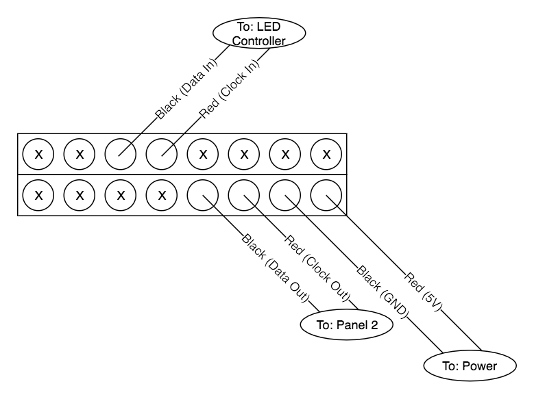

# fraqture

An interactive art framework that takes inputs from social media, maps them to the
interactive parts of a drawing, and renders the art. The platform consists of a 50"
TV display driven by Clojure's Quil library outlined with 540 DotStar LEDs driven by
a Teensy 3.2.


## Exhibitions

Come see fraqture live!

You can find Fraqture today in the [21C storefront window](https://goo.gl/maps/rb3uesMPJB92) in downtown Durham, NC.

- March 14-16th - [New Orleans Entrepreneurs Week](https://noew.org/)
- Now - Downtown Durham


## Usage

`lein run <drawing name>`

For examples of what each of the drawings does, check out the gifs in [examples.md](examples.md).
Start by trying `lein run cycle`.

# Hardware

The Fraqture Project uses two custom-build LED panels with 270 individually addressable LEDs each
to extend our canvas out from the screen. We are using a
[Teensy 3.2](https://www.pjrc.com/store/teensy32.html) to receive commands over a serial connection
and use them to refresh the panels. The sections below discusses how to connect and issue commands
to the panels.

### Reset Communications

The LED serial communication is a basic state machine. When a device connects to the panel driver,
it is impossible to know whether it is in the default state or not. To reset the state machine of
the panel driver, simply wait 2 seconds in between messages and the state will be reset.

## LED Commands

All LED panel commands follow the same structure, where the payload is strictly packed and all
numbers larger than 8 bits are packed little endian.

```
1 BYTE        0-7 BYTES
+------------+-----------------+
| COMMAND ID | COMMAND PAYLOAD |
+------------+-----------------+
```

New commands can easily be added using the `terminal_attach(terminal_t *term, terminal_cmd_t *cmd)`
function found in `arduino/strobe/terminal.c`.

### Refresh Pixels

This command will refresh the LED array. This allows you to do multiple paint operations without
eating the cost of refreshing the array after each one.

Command ID: `R`

### Clear Pixels

This command will clear the LED arrays. This command has no payload.

Command ID: `S`

### Window Pixels

This command will paint a window of pixels.

Command ID: `W`

Payload (in order):
- `u8 row-start`: the starting row for the window
- `u8 col-start`: the starting column for the window
- `u8 row-end`: the starting row for the window
- `u8 col-end`: the ending row for the window
- `u8 r`: the brightness of the red LED in the pixel
- `u8 g`: the brightness of the green LED in the pixel
- `u8 b`: the brightness of the blue LED in the pixel

### Set Pixel

This command will set an individual pixel.

Command ID: `S`

Payload (in order):
- `u16 index`: the index of the pixel. The top left is pixel 0, and then it reads like a book.
- `u8 r`: the brightness of the red LED in the pixel
- `u8 g`: the brightness of the green LED in the pixel
- `u8 b`: the brightness of the blue LED in the pixel

## Requirements

- Install Java JRE or JDK from [Oracle's website](http://www.oracle.com/technetwork/java/javase/downloads/index.html).
- `brew install leiningen` (or install it for your OS using [these instructions](http://leiningen.org/))
- Imagesnap `brew install imagesnap` (or install it from [here](http://iharder.sourceforge.net/current/macosx/imagesnap/))

## System Setup

The overall diagram of how the LED controller, LED panels, power supply, and Mac Mini all interact can be seen below:


Since LED data is a serial stream, it originates by the Mac Mini's program sending data to the LED controller, which then sends it out to the 540 LEDs using SPI. The individual wires that need to be connected can be found below.

For the panel connections, the diagram shows a closeup of the screw terminals found on the backs of the panels. The panels should be positioned so that the screw terminals are in the lower-left of each panel. A legend for these connectors is below:

```
Line - Wire to another component.
X - Internal panel connection; leave connected.
N/C - No connection.
```

---

### LED Controller


---

### Panel 1 (Top)



---

### Panel 2 (Bottom)


---

### Power Supply Unit (PSU)


